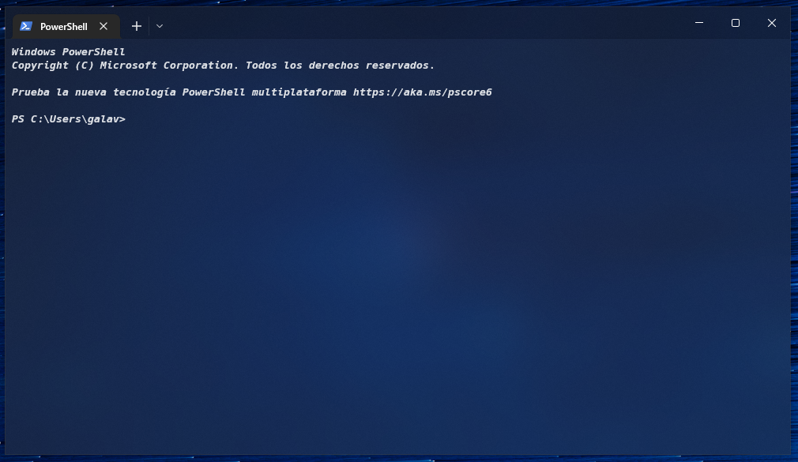
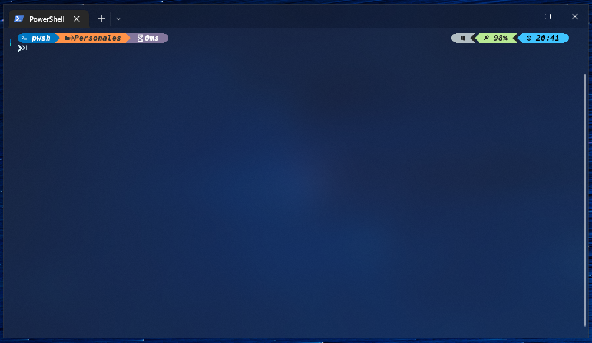
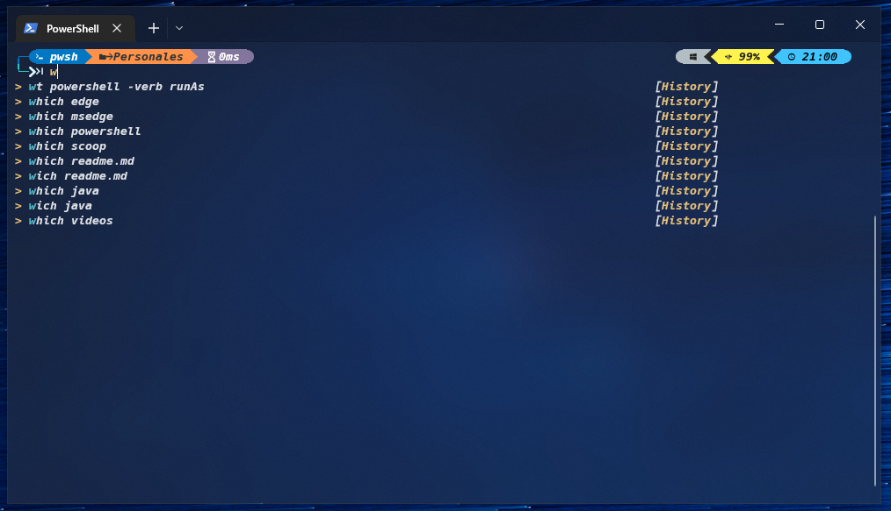
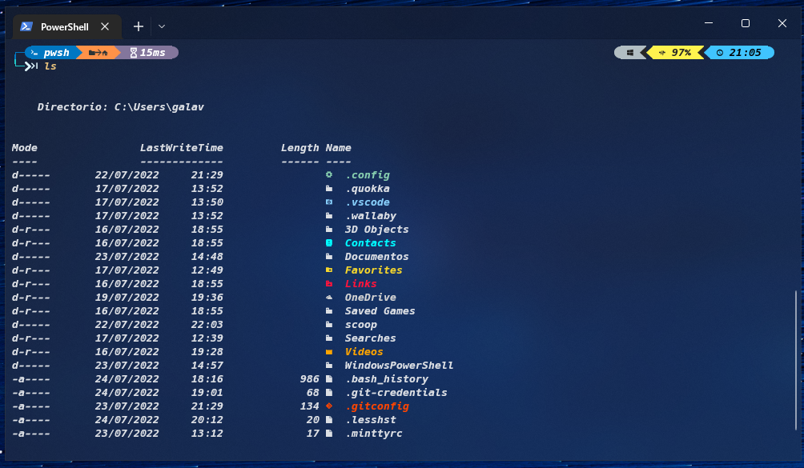
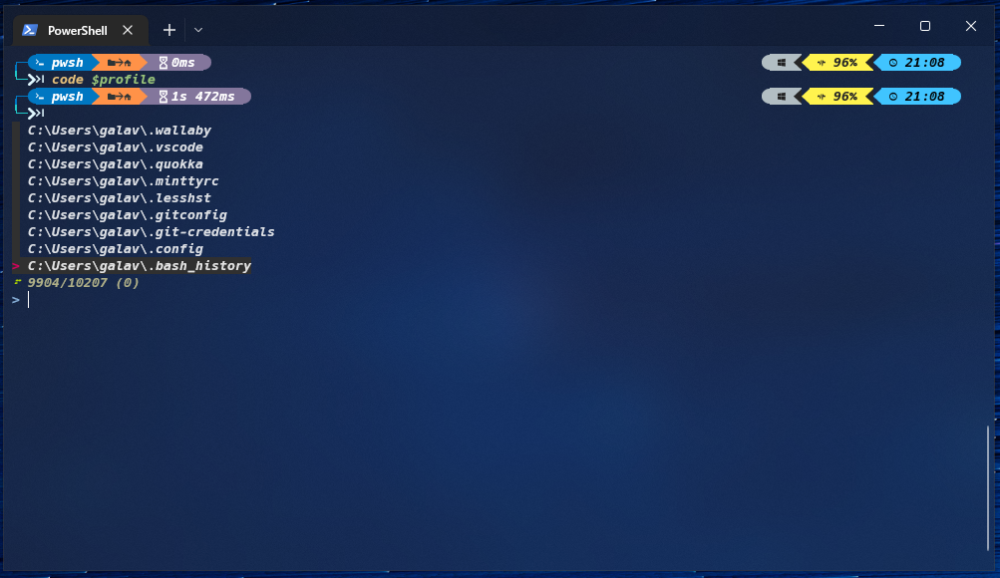
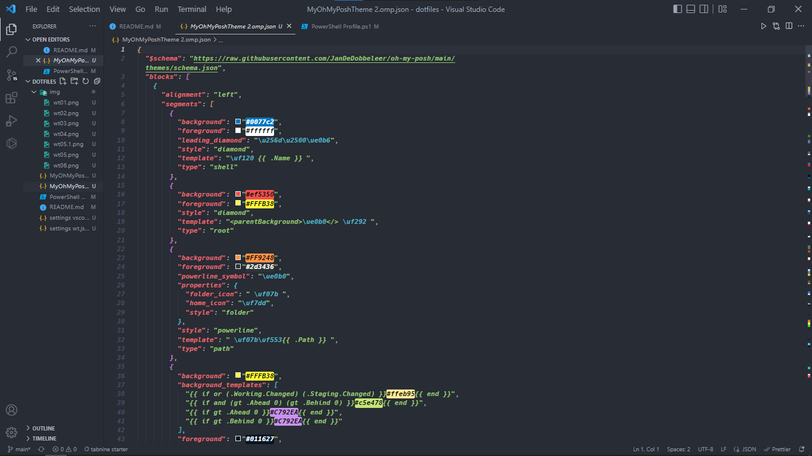
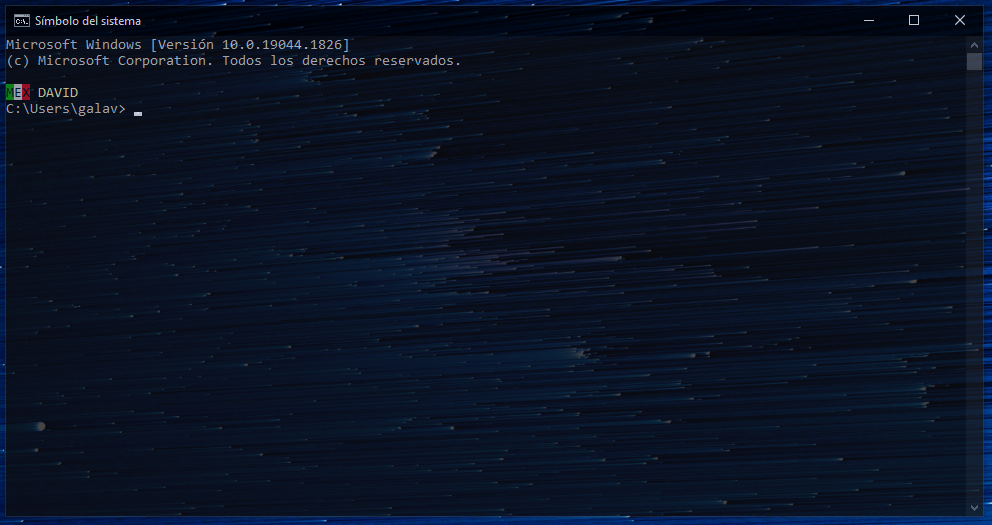

# My Dotfiles For Windows
---
Hola a todos en este readme indico las instrucciones para configurar de la misma manera que yo windows terminal, vscode y hay un regalito al final, espero les agrade.

Esta configuración funciona para windows terminal y visual studio code.
Los resultados de los cambios no son notorios al instante, por lo cual deben deben cerrar y volver a abrir el programa que esten personalizando.

Cualquier observación o comando obsoleto, pueden indicarlo al siguiente email:   
**David Galavíz** <galavzigdavid899@gmail.com>  

## Resultados Windows terminal (WT) 

Este espacio será dedicado a una colección de imagenes de los resultados generados mientras avanzo por la modificación.  

Este cambio se hizo con la configuración nativa de wt:

Aquí se modifico le prompt después de agregar Oh My Posh:
 

Añadí PSReaLine, para que muestre un historial de los comandos que hayamos ingresado mientras vamos escribiendo:
 

Añadi también Terminal-Icons para la cuando listemos los archivos de un directorio nos muestre de que tipo són y con una condiguración de colores:
 

Agregue PsFzf qe añade una función especial para ver el historial con formato decendente ademas de que nos puede mostrar solo las rutas ingresadas, o todos los comandos escritos.

Mostrando solo las rutas:
 

Mostrando los comandos escritos:
 

## Resultados Visual Studio Code (VSCode)

En visual studio code, no realice muchas modificaciones esteticas solo fueron prácticas, pero aun así subo una imagen, por si les pica la curiosidad.  

Tema: *One Dark Pro Flat*

 

---
# Configuración de WT
Al modificar el prompt utilizaremos iconos que no se encuntrar por defecto en las fuentes de Windows, así que descargate una fuente de [`NerdFonts`](https://github.com/ryanoasis/nerd-fonts/releases), yo recomiendo *Hack NF*.  

Para empezar a configurar nuestra terminal yad debe estar descargada la Windows Terminal, esta la puedes conseguir desde la tienda de Microsoft si no la tienenes, los usuarios de windows 11 la traen por defecto.  
Empezaremos actualiando la política de ejecuciónes de escript con el siguiente comando, pegalo y ejecutalo en tú terminal, este comando se ejecuta desde el modo administrador, y te recomiendo que no lo utilices amenos que sepas lo que haces  
   
    Set-ExecutionPolicy -ExecutionPolicy Unrestricted

Por otro lado para los usuarios menos experimentados les recomiendo que ejecuten el siguiente, funcionan para el mimso fin, solo que este ejecuta los cambios para el usuario actual.  

    Set-ExecutionPolicy -ExecutionPolicy Unrestricted -Scope CurrentUser

>¡Bien ahora podemos empezar!

En la terminal empezamos por instalar [`Scoop`](https://github.com/ScoopInstaller/Scoop) que en pocas palabras es un instlador de programas desde la línea de comandos. 
Ejecuta el comando desde tu terminal y acepta todo lo solicitado. 

    iwr -useb get.scoop.sh | iex

Una vez tengas instalador Scoop procederemos a instalar [`aria2`](https://github.com/aria2/aria2) que ayuda con las descargas de conexión multiple.

    scoop install aria2 

Ahora instalaremos [`OH-My-Posh`](https://ohmyposh.dev/docs/installation/windows), para ello ejecutaremos el siguiente comando.  

    scoop install https://github.com/JanDeDobbeleer/oh-my-posh/releases/latest/download/oh-my-posh.json

Actualizamos oh-my-posh.  

    scoop update oh-my-posh

Después de ello debemos de crear un perfil de powershell para ello, haremos lo siguiente.
Escribitemos en la terminal el siguiente comando, que abre el perfil de powershell creado.

    notepad $profile

Comúnmente el comando no genera errores aunque no haya perfil, si ho existe un perfil, al ejecutarse el comando abirar el notepad, y salta una venta emergente que dice que no hay un perfil que si deseas crar uno, y después solo precionas que sí.  
En caso de que no te muestre la ventana emergente, lo que tienes que hacer es ejecutar el siguiente comando.  

    New-Item -Path $PROFILE -Type File -Force
Después volvemos a ejecutar el primero comando.
Y en el bloc de notas pegamos la siguiente linea.

    oh-my-posh init pwsh --config C:\Users\***\scoop\apps\oh-my-posh\8.22.1\themes\atomic.omp.json | Invoke-Expression
En la parte de la ruta tiene que ser cambiada y poner la ruta propia donde se encuentran los temas de OMP, te puedes guiar por la ruta que esta de ejemplo, para buscar la tuya.  
Para ver los temas que tiene OMP, podemos ejecutar el siguiente comando.  

    Get-PoshThemes
Este nos mostrara en forma de lista todos y cada uno de los temas existentes después nos dirigimos al bloc de notas y pegamos el nombre del tema.

    C:\.\.\tema.omp.json | Invoke ....
Si quieres crear tu tema propio o modificar un existente solo consta de abrirlo en un editor de texto.

Oh-My-Posh es un buen modificador del prompt, pero alenta el tiempo de apertura de nuestra terminal.

Para aquellos que no nos gusta esperar ni dos segundos, tengo el siguiente modificador del prompt.

[`Starship`](https://starship.rs/guide/#%F0%9F%9A%80-installation) que hace los mismo que oh-my-posh pero de una manera más rapida. Para instalarlo ejecutamos el siguiente comando:

    scoop install starship

Despues pegamos las siguientes lineas en nuestro perfil de powershell.

    Invoke-Expression (&starship init powershell)

Recomiendo que leean un poco la documentación para la modificación de este.

Ahora instalaremos [`Terminal-Icons`](https://github.com/devblackops/Terminal-Icons), para ello ejecutaremos el siguiente comando.

    Install-Module -Name Terminal-Icons -Repository PSGallery
Después nos dirigiremos al bloc de notas y pegaremos lo siguiente.

    Import-Module -Name Terminal-Icons

>Estamos listos para ejecutra un ls.

Ahora instalaremos [`PsReadLine`](https://github.com/devblackops/Terminal-Icons), para ello ejecutaremos el siguiente comando.

    Install-Module -Name PSReadLine -AllowPrerelease -Scope CurrentUser -Force -SkipPublisherCheck
Ahora copiaremos los siguiente en el bloc de notas.
~~~
    Import-Module PSReadLine
    Set-PSReadLineOption -EditMode Emacs
    Set-PSReadLineOption -BellStyle None
    Set-PsReadLineKeyHandler -Chord 'Ctrl+d' -Function DeleteChar
    Set-PSReadLineOption -PredictionViewStyle ListView
    Set-PSReadLineOption -PredictionSource History
~~~

>Queda listo para empezar a predecir los comandos escritos.

Por último instalaremos [`Fzf`](https://github.com/junegunn/fzf#windows) ejecutaremos el siguiente comando.

    scoop install fzf
Pegaremos lo siguiente en el bloc de notas.
~~~
    Import-Module PsFzf
    Set-PsFzfOption -PsReadlineChordProvider 'Ctrl+f' -PsReadlineChordReverseHistory 'Ctrl+r'
~~~
Guiate de los atajos de teclado que configure para explorar su funcionalidad.
>Ahora sí podemos concluir con nuestra terminal.

#### He dejado algunos archivos de mis configuraciones propias para vscode y windows terminal, ademas de mi perfel de powershell y dos temas de OMP configurados por mí para que los puedas explorar u ocupar a tu gusto.  

### Mencione antes que deje una sorpresa para el final así que vamos a darle.
Modificaremos un poco el prompt del CMD.   

Te enseñare a hacer tu bandera y poner tu nombre en el prompt de CMD.

Para ello necesitaremos [`ColorTool`](https://github.com/Microsoft/Terminal/tree/main/src/tools/ColorTool) que es la herramienta con la cual veremos los colores. 
Una vez descargado extraeremos el archvio y desde la raíz del archivo ejecutamos el siguiente comando.  

    ColorTool.exe -c

La documntación para hacer esto la encontraras en el archivo `PromptCMD.pdf`exit

>Solo queda agraderce por leer :) **Gracias!**

